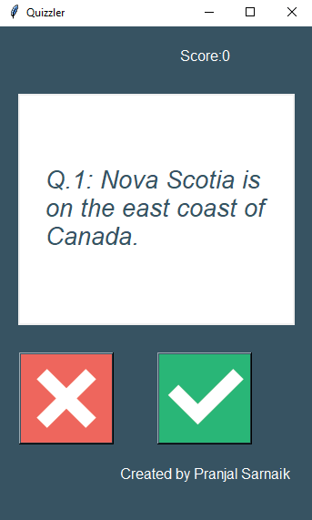
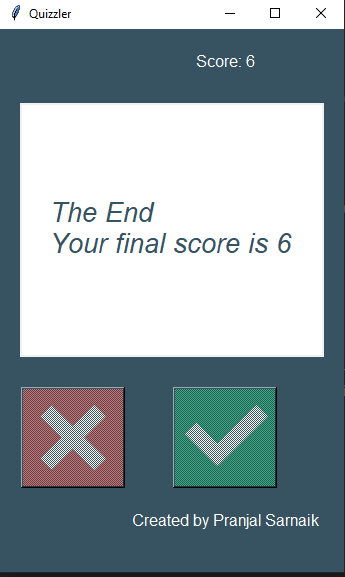

# Quizzler
The **Quizzler** project is a quiz game application built using **OOP** and **Tkinter**. It fetches ten questions from the Open Trivia Database API and allows users to answer them through an interactive interface.  

## Screenshots
, 

## Author
Pranjal Sarnaik

## Features
- Dynamically fetches quiz questions from an API.  
- Provides real-time feedback with color-coded responses.  
- Displays and updates the score as players progress.  
- Disables buttons and shows a final score upon completion.  
- Organized with three main classes: `Question`, `QuizBrain`, and `QuizUI`.  

## Level
Intermediate

## Tech Stack
API Integration | OOP | Tkinter GUI | Game Development | Python

## How to Run
1. Clone the repo:  
   ```bash  
   git clone https://github.com/pranjalco/quizzler.git

2. Run(Also install required libraries):
    ```bash  
   pip install requests  
   python app.py

**Created by Pranjal Sarnaik**  
*Released under the MIT License*